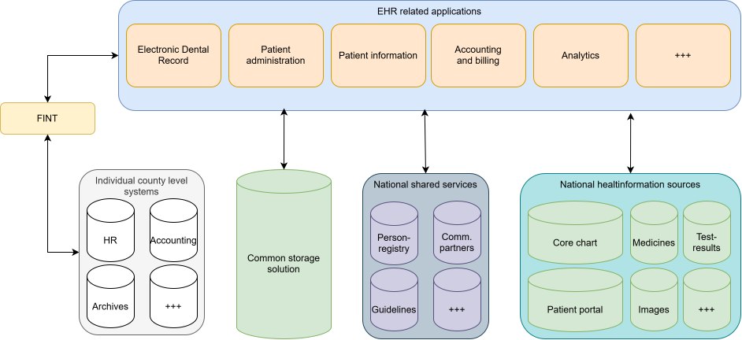
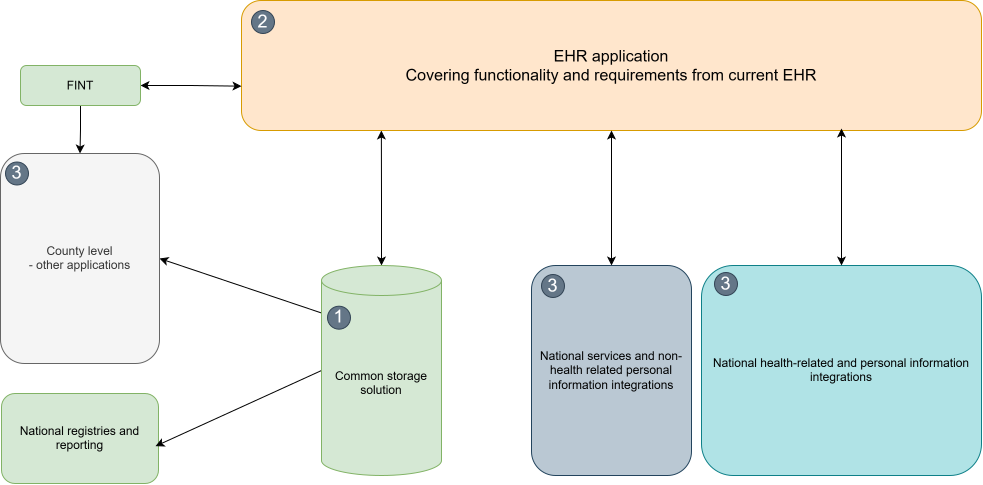

# Overall architecture

We have defined the following overall target architecture as a means to achieve a common storage solution as the foundation for the shared Electronic Health Record (EHR) platform for the public dental service in Norway.

## Highlevel architecture explained

| System or specification | Context |
| :--- | :--- |
| EHR related applications | Applications or components that together make up for and provides the functionality required by the public dental service in Norway. |
| Common storage solution | The shared service for persisting EHR related data and is the single source of truth for the entire public dental service across Norway. |
| County level systems | Individual county level systems are in general connected with the public dental service through a common integration plattform FINT. |
| National shared services | We have a set of national shared services in Norway that is available to be used by EHR related applications. |
| National health information sources | We have a set of national sources for health information that is available to be used by EHR related applications. |

## Highlevel architecture principles

The following principles are defined as the founation for this architecture:

- The single source of truth for health record related data is the Common storage solution.
- The components that are part of the EHR related applications are shared and common on a national level in Norway.
- The shared national services and data sources is the owner of the relevant data.
- Do not duplicate data more than strictly nessecery, lookup data from the correct source owning the data.

## Short term plan towards 2028

As a first step towards the overall target architecture we have defined the following plan towards 2028.

The plan towards 2028 is divided into 3 steps or phases.

1. We will design and build what will be a shared Common storage solution. This will become the main element in the overall architecture and will be the single source of truth for other services that want to interact with electronic health record related data in the national dentist service.
2. Next we will accuire an EHR application on top of the shared common storage that will be the interface and business logic towards the clinics and healthcare personel in the counties. The goal is to cover as much as possible of the functionality that is in use from the existing EHR applications used by the different counties and clinics.
3. The third step will be to look at what desired functionality we can cover that is not covered already. This may include integration with accountin systems or national services providing functionality that will boos the efficiency of the clinics or improve the user expirience of the patients.

## Further reading

See: links here
